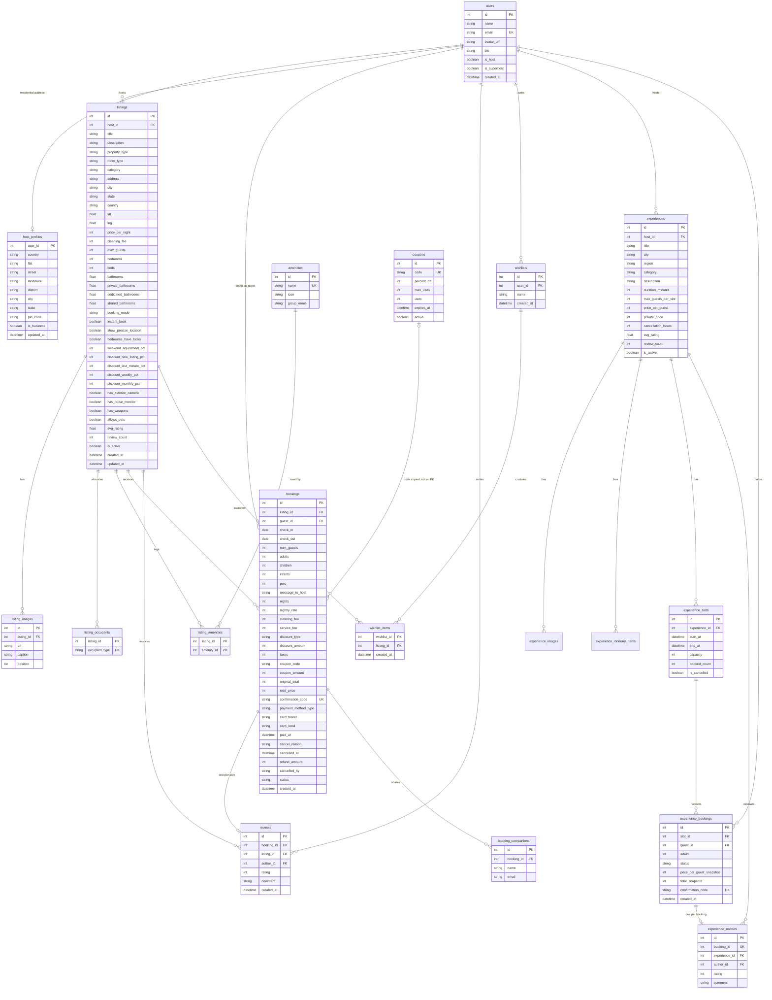

# Database schema

Money columns are integers (whole INR). `check_in` is inclusive and `check_out` is exclusive. Listing delete is `RESTRICT` when bookings exist; images, amenity links, occupants, reviews, and wishlist rows cascade.

SQLite `create_all` does not alter tables that already exist. After a schema change, rebuild from the `backend` directory with `python -m app.seed --reset`.

Pricing for quotes and bookings is computed only in `pricing_service.quote_price` (weekend rates, single best listing discount, coupon, service fee, GST). Taxes are 5% of the nightly total after the listing discount and coupon, plus the cleaning fee, rounded half-up. The service fee stays 14% of the nightly total after the listing discount plus the cleaning fee, and a coupon does not change it. Pending and confirmed bookings block dates. A pending request expires 24 hours after `created_at`. Card numbers are not stored. `bathrooms` on a listing is the sum of the three bathroom columns, maintained on host create/update.
